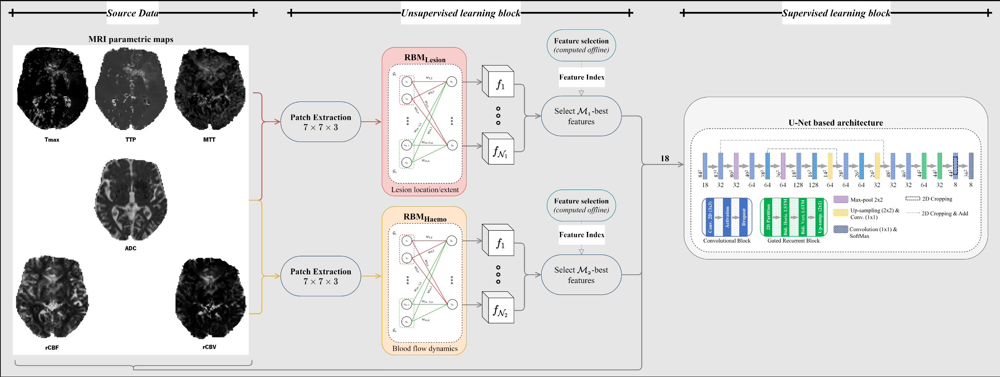

# Combining unsupervised and supervised learning for predicting the final stroke lesion


This repository contains materials to reproduce the prediction results of the main experiments of the paper ```"Pinto, Adriano, et al. "Combining unsupervised and supervised learning for predicting the final stroke lesion." Medical image analysis 69 (2021): 101888."```


[Google Scholar](https://scholar.google.pt/citations?view_op=view_citation&hl=en&user=gokIeOIAAAAJ&sortby=pubdate&citation_for_view=gokIeOIAAAAJ:YsMSGLbcyi4C ) | [Medical Image Analysis Journal](https://www.sciencedirect.com/science/article/pii/S1361841520302528?casa_token=qhYbXkOgCsIAAAAA:QIcUY2HG4UQfo0TNwHKDF2kFJOHXwdwVtdqMxBH6Y6kgx9gV-i4F4yI_ouwpLBTX8mgTHtcFJ-w) | [ArXiv](https://arxiv.org/pdf/2101.00489)

---

## Table of contents
1. [Overview](#Overview)

2. [Results](#Results)
    
    2.1. [Sub paragraph](#subparagraph1)

3. [Requirements](#Requirements)

4. [BibTex](#BibTex)

---

## 1. Overview <a name="Overview"></a>

This work combines unsupervised machine learning, particularly resorting to RBMs, with a supervised deep learning-based architecture (U-Net).



## 2. Results <a name="Results"></a>

The proposed method was evaluated in two datasets:ISLES 2017 dataset, publicly available, which provides an online benchmark platform; Private dataset, containing 23 acute ischemic stroke patients acquired at Bern University Hospital in Switzerland.

<p align="center">

<table class="tg">
  <tr>
    <th class="tg-lm6i" col width="220" rowspan="2"><br>Method </th>
    <th class="tg-lm6i" colspan="5" align="center"> ISLES 2017 Challenge </th>
  </tr>
  <tr>
    <td class="tg-lm6i"><div align="center">Dice</td>
    <td class="tg-lm6i"><div align="center">H.D.</td>
    <td class="tg-lm6i"><div align="center">ASSD</td>
    <td class="tg-lm6i"><div align="center">Precision</td>
    <td class="tg-lm6i"><div align="center">Recall</td>
  </tr>
  <tr>
    <td class="tg-7x02"><div align="left">Mok et al. *</td>
    <td class="tg-akyt">0.32 ± 0.23</td>
    <td class="tg-akyt">40.74 ± 27.23</td>
    <td class="tg-akyt" align="center">8.97 ± 9.52</td>
    <td class="tg-akyt">0.34 ± 0.27</td>
    <td class="tg-akyt">0.39 ± 0.27</td>
  </tr>
  <tr>
    <td class="tg-7x02"><div align="left">Kwon et al. *</td>
    <td class="tg-akyt">0.31 ± 0.23</td>
    <td class="tg-akyt">45.26 ± 21.04</td>
    <td class="tg-akyt" align="center">7.91 ± 7.31</td>
    <td class="tg-akyt">0.36 ± 0.27</td>
    <td class="tg-akyt">0.45 ± 0.30</td>
  </tr>
  <tr style="border-bottom:1.5px solid white">
    <td class="tg-7x02"><div align="left">Robben et al. *</td>
    <td class="tg-akyt">0.27 ± 0.22</td>
    <td class="tg-akyt">37.84 ± 17.75</td>
    <td class="tg-akyt" align="center">6.72 ± 4.10</td>
    <td class="tg-akyt">0.44 ± 0.32</td>
    <td class="tg-akyt">0.39 ± 0.31</td>

  </tr>
  
  <tr>
    <td class="tg-7x02"><div align="left">Pisov et al. *</td>
    <td class="tg-akyt">0.27 ± 0.20</td>
    <td class="tg-akyt">49.24 ± 32.15</td>
    <td class="tg-akyt" align="center">9.49 ± 10.56</td>
    <td class="tg-akyt">0.31 ± 0.27</td>
    <td class="tg-akyt">0.39 ± 0.29</td>
  </tr>

  <tr>
    <td class="tg-7x02"><div align="left">Monteiro et al. *</td>
    <td class="tg-akyt">0.30 ± 0.22</td>
    <td class="tg-akyt">46.60 ± 17.50</td>
    <td class="tg-akyt" align="center">6.31 ± 4.05</td>
    <td class="tg-akyt">0.34 ± 0.27</td>
    <td class="tg-akyt">0.51 ± 0.30</td>
  </tr>
  <tr>
    <td class="tg-7x02"><div align="left">Lucas et al. *</td>
    <td class="tg-akyt">0.29 ± 0.21</td>
    <td class="tg-akyt">33.85 ± 16.82</td>
    <td class="tg-akyt" align="center">6.81 ± 7.18</td>
    <td class="tg-akyt">0.34 ± 0.26</td>
    <td class="tg-akyt">0.51 ± 0.32</td>
  </tr>
  <tr>
    <td class="tg-7x02"><div align="left">Choi et al. *</td>
    <td class="tg-akyt">0.28 ± 0.22</td>
    <td class="tg-akyt">43.89 ± 20.70</td>
    <td class="tg-akyt" align="center">8.88 ± 8.19</td>
    <td class="tg-akyt">0.36 ± 0.31</td>
    <td class="tg-akyt">0.41 ± 0.31</td>
  </tr>
  <tr>
    <td class="tg-7x02"><div align="left">Niu et al. *</td>
    <td class="tg-akyt">0.26 ± 0.20</td>
    <td class="tg-akyt">48.88 ± 11.20</td>
    <td class="tg-akyt" align="center">6.26 ± 3.02</td>
    <td class="tg-akyt">0.28 ± 0.25</td>
    <td class="tg-akyt">0.56 ± 0.26</td>
  </tr>
  <tr>
    <td class="tg-7x02"><div align="left">Sedlar et al. *</td>
    <td class="tg-akyt">0.20 ± 0.19</td>
    <td class="tg-akyt">58.30 ± 20.02</td>
    <td class="tg-akyt" align="center">11.19 ± 9.10</td>
    <td class="tg-akyt">0.23 ± 0.24</td>
    <td class="tg-akyt">0.40 ± 0.29</td>
  </tr>
  <tr>
    <td class="tg-7x02"><div align="left">Rivera et al. *</td>
    <td class="tg-akyt">0.19 ± 0.16</td>
    <td class="tg-akyt">63.58 ± 18.58</td>
    <td class="tg-akyt" align="center">11.13 ± 7.89</td>
    <td class="tg-akyt">0.27 ± 0.25</td>
    <td class="tg-akyt">0.21 ± 0.17</td>
  </tr>
  <tr>
    <td class="tg-7x02"><div align="left">Islam et al. *</td>
    <td class="tg-akyt">0.19 ± 0.18</td>
    <td class="tg-akyt">64.15 ± 28.51</td>
    <td class="tg-akyt" align="center">14.17 ± 15.80</td>
    <td class="tg-akyt" >0.29 ± 0.28</td>
    <td class="tg-akyt">0.25 ± 0.25</td>
  </tr>
  <tr>
    <td class="tg-7x02"><div align="left">Chengwei et al. *</td>
    <td class="tg-akyt">0.18 ± 0.17</td>
    <td class="tg-akyt">65.95 ± 25.94</td>
    <td class="tg-akyt" align="center">9.22 ± 6.99</td>
    <td class="tg-akyt">0.37 ± 0.30</td>
    <td class="tg-akyt">0.21 ± 0.23</td>
  </tr>
  <tr style="border-bottom:1.5px solid white">
    <td class="tg-7x02"><div align="left">Yoon et al. *</td>
    <td class="tg-akyt">0.17 ± 0.16</td>
    <td class="tg-akyt">45.23 ± 19.14</td>
    <td class="tg-akyt" align="center">12.43 ± 11.01</td>
    <td class="tg-akyt">0.23 ± 0.27</td>
    <td class="tg-akyt">0.36 ± 0.32</td>
  </tr>
  <tr>
    <td class="tg-7x02"><div align="left"> <strong> Baseline </td>
    <td class="tg-akyt">0.30 ± 0.21</td>
    <td class="tg-akyt">36.58 ± 16.62</td>
    <td class="tg-akyt" align="center">6.96 ± 5.08</td>
    <td class="tg-akyt">0.30 ± 0.26</td>
    <td class="tg-akyt">0.55 ± 0.31</td>
  </tr>
  
  <tr style="border-bottom:1.5px solid white">
    <td class="tg-7x02"><div align="left"> <strong> Proposal </td>
    <td class="tg-akyt">0.38 ± 0.22</td>
    <td class="tg-akyt">29.21 ± 15.04</td>
    <td class="tg-akyt" align="center">5.52 ± 5.06</td>
    <td class="tg-akyt">0.41 ± 0.26</td>
    <td class="tg-akyt">0.53 ± 0.29</td>
  </tr>
</table>

_*_  --  Methods presented in [Winzeck et al. (2018)](#1), whose results were retrieved from [SMIR Online Platform (2017)](#1).

## 3. Requirements <a name="Requirements"></a>

To load the models and callbacks please install the environment provided at the [yml file](environment.yml)


## 4. BibTex <a name="BibTex"></a>

```latex
@article{pinto2021combining,
  title={Combining unsupervised and supervised learning for predicting the final stroke lesion},
  author={Pinto, Adriano and Pereira, S{\'e}rgio and Meier, Raphael and Wiest, Roland and Alves, Victor and Reyes, Mauricio and Silva, Carlos A},
  journal={Medical image analysis},
  volume={69},
  pages={101888},
  year={2021},
  publisher={Elsevier}
}
```

## References


<a id="1">[1]</a> - Winzeck, S., Hakim, A., McKinley, R., Pinto, J.A.A.D.S., Alves, V., Silva, C.,
Pisov, M., Krivov, E., Belyaev, M., Monteiro, M., et al., 2018. ISLES 2016
& 2017-benchmarking ischemic stroke lesion outcome prediction based on
multispectral MRI. Frontiers in Neurology 9, 679.

<a id="1">[2]</a> - SMIR Online Platform, 2017. Ischemic stroke lesion segmentation 2017.
https://www.smir.ch/ISLES/Start2017. [Acessed: 2019-11-18].

